# Installation & Navigation of Visual Studio Code

## 1. Installation

Visit the official VS Code Download page https://code.visualstudio.com/
Select the Operating System that best aligns with your preferences and project requirements.
Since I'm currently using Linux Ubuntu,I selected the Linux download option.

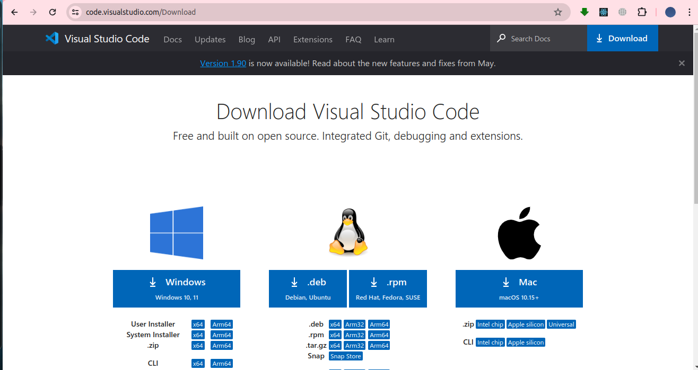

I preferred this approach since it was way more efficient

### Installation from the terminal

Install VS Code using the following commands:
    sudo apt update 
    sudo apt install code

Launch VS Code by running: 
    code

PREREQUISITES:  Ensure you have administrative privileges to install any software.

## 2. First-time Setup
### Initial Settings and Configurations

I. Theme and Apperance

    > Open VS Code
    > Go to `File > Preferences > Theme` to choose a preffered theme
    > My current color theme: 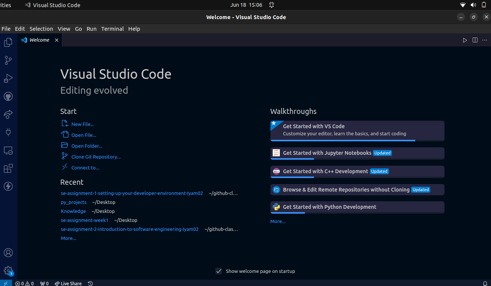
    > For more themes, click on the extension icon to install more themes.

II. Install Key Extensions

    > Use the Estension present on the sidebar or by `Ctrl+Shift+X` key shortcut to install essential extensions:
        . Prettier (Code Formatter)
        . Live Server
        . Python 
        .Code Runner
        .Python Debugger
    
    > Ensure you download extensions from trusted sources.

III. Configure Settings
    > Open `File > Preferences > Settings`.
    > Shortcut key for settings: Ctrl+,
    > Adjust settings such as font-size, tab size, auto save

IV. Setup Version Control

    >Configure Git by setting up your name and email
    > Code: 
            git config --global user.name "Name"
            git config --global user.email "my.email@example.com"

    The name and email should be the same as the one used when creating github account.

    > To confirm whether the user name and user email is correctly setup, run:
                   git config --global user.name
                   git config --global user.email

## 3. User Interface Overview

I. Activity Bar:
    > Located on the far left, it contains icons for different views:
                Explorer
                Source COntrol
                Extensions    
    
    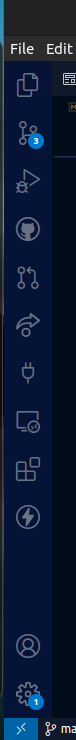

II. Side Bar:
    > Located right next to activity bar 
    > Displays the contents on the selected view.

    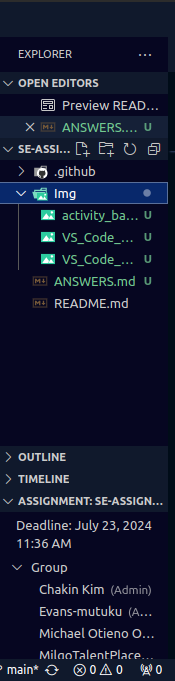

III. Editor Group:
    > Located at the center of the screen
    > This is where files are opened and edited.

    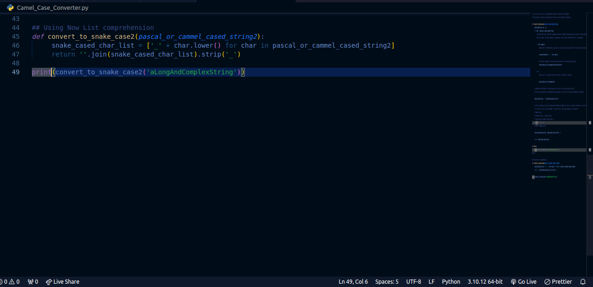

IV. Status Bar
    > Located at the bottom of the screen
    > Shows about the information about the current file such as the line number, ports, active extensions

    

## 4. Command Palette

The Command Palette provides quick access to access all commands in VS Code
Access: Press Ctrl+Shift+P or View > Command Palette

Tasks: 
    > Open settings: Prefences: OPen Settings
    > Open Live Server: Live Server: Open with Live Server
    > Toggles terminal: View: Toggle Integrated Terminal.

## 5. Extensions in Vs Code

### Roles of Extensions
    . They enahnce functionality
    . They let you add languages, debuggers and tools to your installationto support the development workflow

### Finding, Installing and Managing Extensions
#### Finding Extensions
    . Use the extension view on the activity bar
    . Press Ctrl+SHift+X

#### Installing Extensions
    . Search and install desired extension
    . Make sure it is from a trusted source.

#### Managing Extensions
    . View installed extensions to either, disable or uninstall

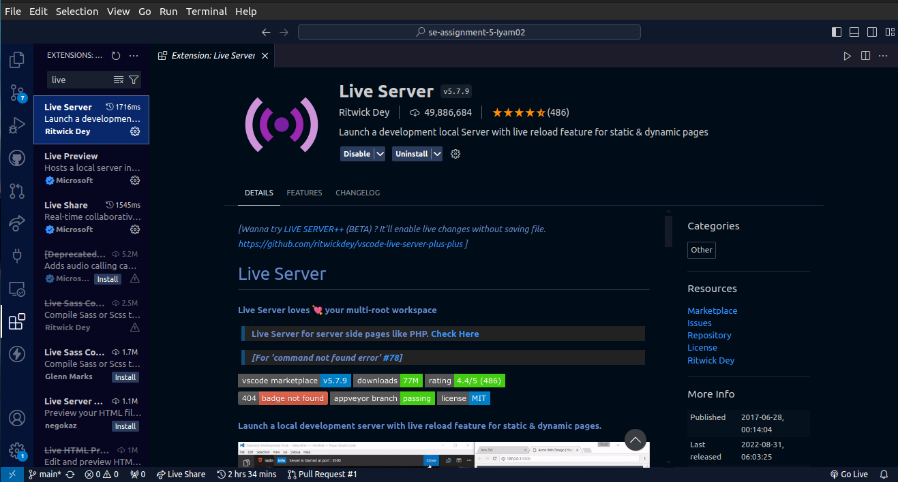

### Essential Extensions for Web Development
.Live Server
.Code Runner
.ESLint
.Live Preview
.HTML CSS JavaScript Snippets

## 6. Integrated Terminal

I.Opening Terminal:
    . Use Ctrl+Shift+`
    .Or go to Terminal > New Terminal

II. Advantages:
    .Run commands directly within VS Code
    . Easy access to project files and directories

## 7.File and Folder Management:

### Creating, Opening, and Managing Files  and Folders

#### I. Creating
    .Right click in the Explorer view and select 'New File' or 'New Folder'

#### II. Opening
    .Double-click on a file in the explorer view

### III.Managing
    .Use the Explorer view and the side bar to manage and find files quickly.

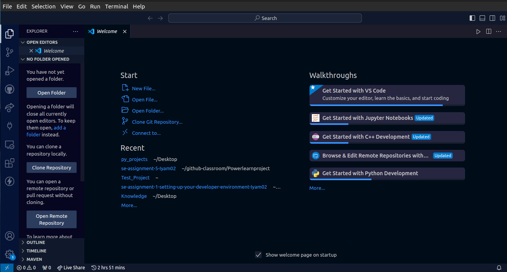

## 8. Settings and Preferences:
### Customize Settings

I. Access Settings:
    .Go to Files > Preferences > Settings.
    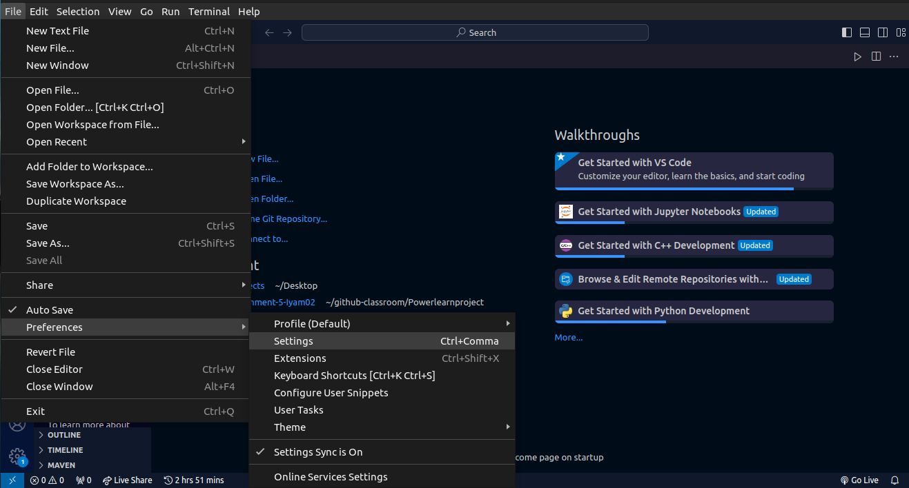

II. Change Theme 
    .Go to File > Preferences > Color Theme
    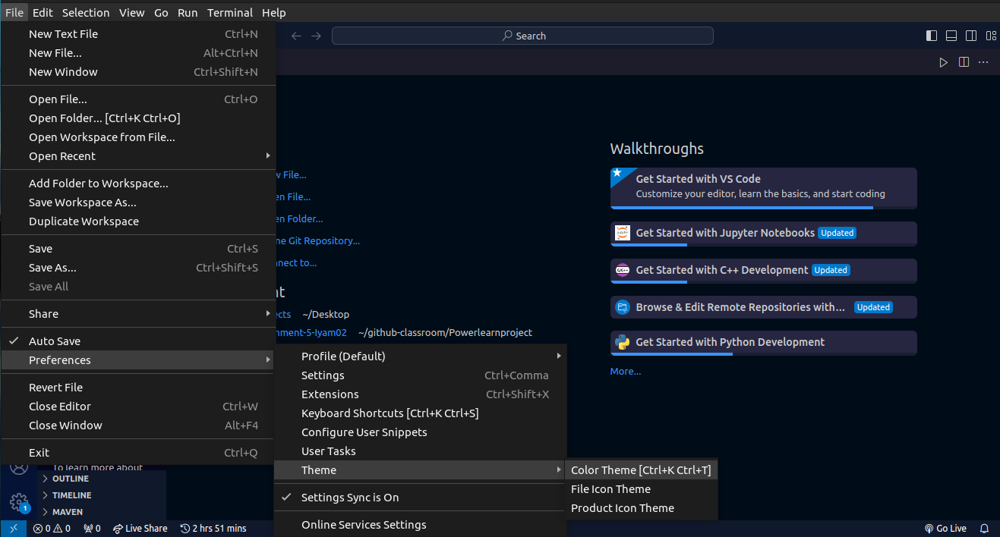

III. Adjust Font Size
    .Navigate to settings
    .Search for 'Editor: Font Size'
    1

## 9. Debugging in VS Code
### Steps to Debug

    I. Open the Debug View
        . Click on the Debug Icon in the Activity Bar
        .Press Ctrl+Shift+D
        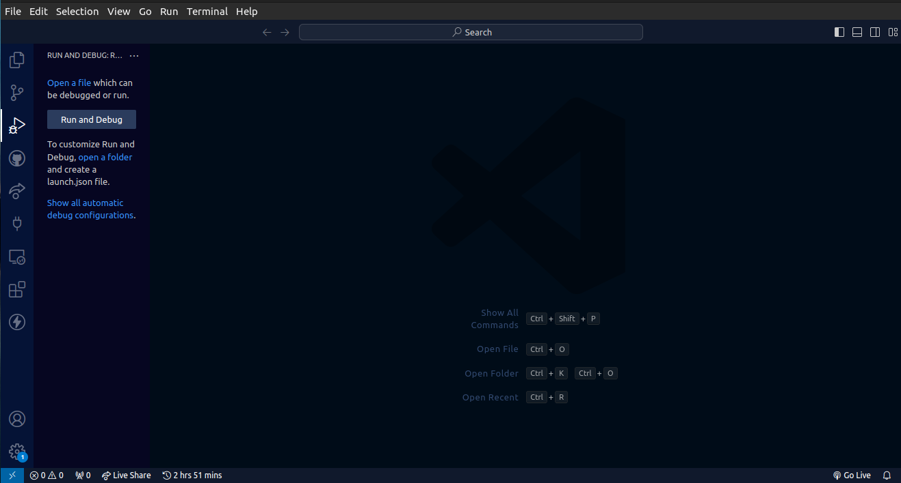

## 10. Using Source Control

### Integrate Git with VS Code

I. Initialize a Repository

    .Open the terminal and navigate to your project directory.
    .Open the terminal using the Ctrl+SHift+` shortcut key.

    1

II. First Commit

    .Add files to the folder
    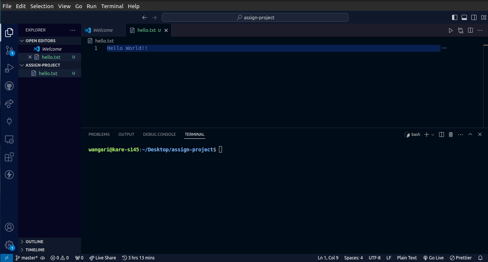

    .Commit changes
    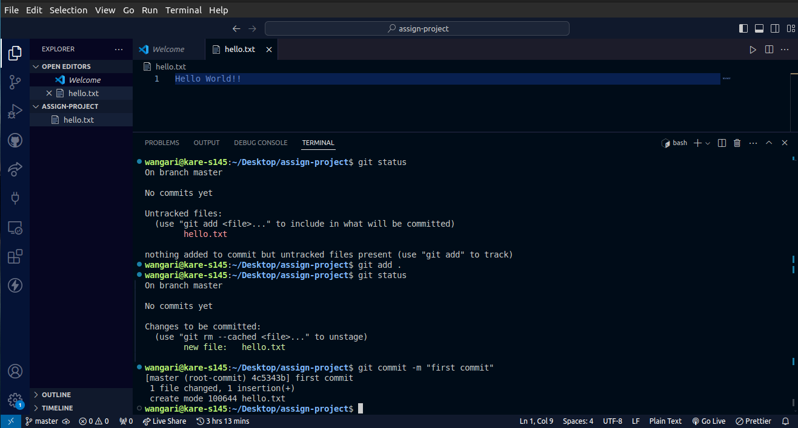

III. Push to Github

    .Create a repository on Github
    .Add the remote URL and push
    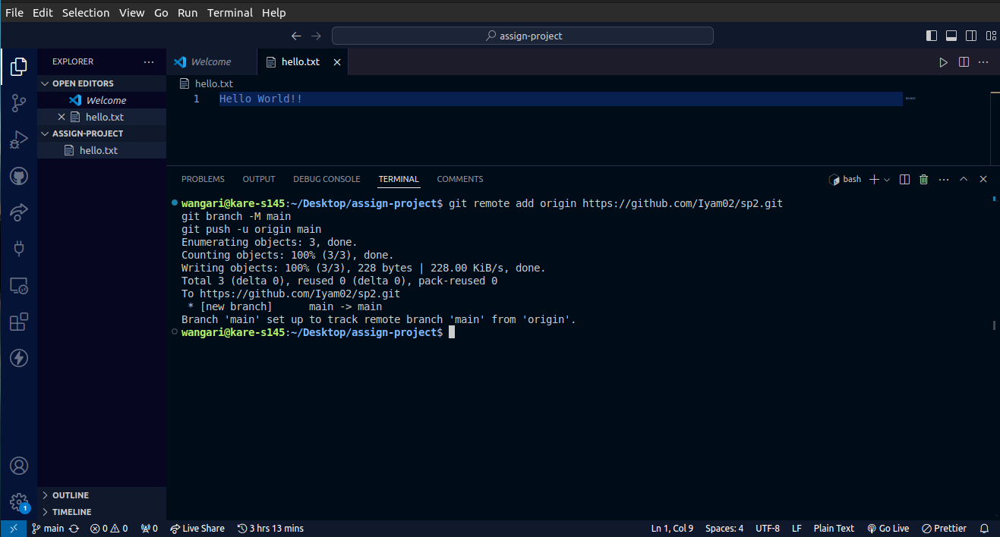
    

#### References
https://code.visualstudio.com/docs/editor/debugging/#:~:text=Once%20you%20have%20your%20launch,configuration%20you%20want%20to%20debug.

https://code.visualstudio.com/docs/editor/extension-marketplace#:~:text=You%20can%20browse%20and%20install,Ctrl%2BShift%2BX.

